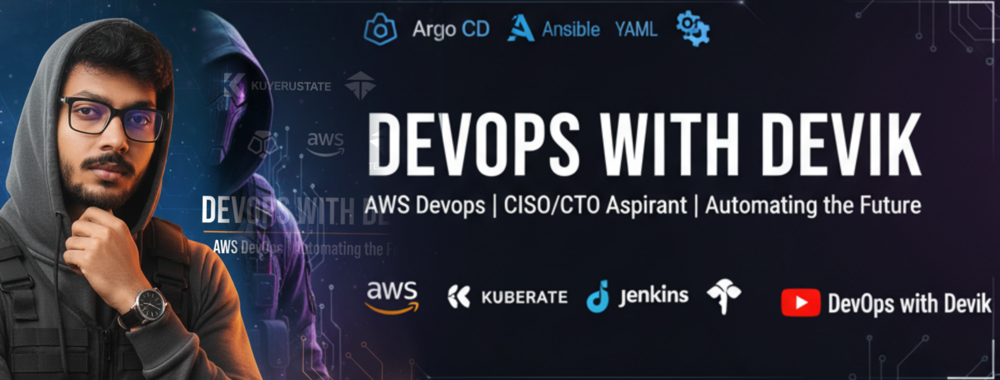

<h1 align="center">Hey Everyone 👋, I'm Devik Sharma</h1>

  

<h3 align="center">A passionate DevOps Engineer from India. I work in the Corporate IT Sector and in my free time I make YouTube videos at <a href="https://www.youtube.com/@DevOpswithDevik" target="_blank">DevOpswithDevik</a></h3>

  
  
  

  

- 👨‍💻 All of my projects are available at [https://github.com/DevOpswithDevik](https://github.com/DevOpswithDevik)  
- 💬 Ask me about **DevOps & Cloud DevOps**  
- 📫 How to reach me **devopswithdevik@gmail.com**

---

<h3 align="left">Connect with me:</h3>

  
  
  

---

<h3 align="left">Languages and Tools:</h3>

  
  
  
  
  
  
  
  
  
  
  
  
  
  
  
  
  
  

&nbsp;

---
### 🔥 GitHub Contribution Streak

---

### 🔝 Top Contributed Repo

---

### 👨‍💼 About Me & 🤝 Open to Collaborations

🎤 Available for **Guest Sessions / Webinars**  
🤝 Open to **Project Collaborations / YouTube Collabs**  
💼 Offering **DevOps Consulting / Mentorship**  
📧 Let’s chat: [devopswithdevik@gmail.com](mailto:devopswithdevik@gmail.com)

> *"Building the next generation of DevOps engineers through practical learning, cloud skills, and automation power!"*
